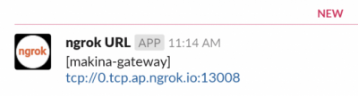

# Ngrok URL Notificator
This script can send url, which was generated by ngrok service running on your local machine to slack.


## Background
In our univeristy, we can not open ngrok's web page due to internal network policy.  
Because of this problem, we can't check ngrok's url, generated by running on our local machine.  
This script can check ngrok's url through slack app.  


## Requriment
You must install jq, which will be used by this script.

```console 
$ sudo apt install jq
```

You have to prepare slack apps for using this script.  
Before running, please make slack apps and get slack webhook urls.

Please refere to following url.  
https://api.slack.com/apps


## Running
```
$ git clone
$ cd Ngrok_URL_Notificator
$ chmod +x send_ngrok_tcp_url_to_slack.sh
$ ./send_ngrok_tcp_url_to_slack.sh
Usage: send_ngrok_http_url_to_slack.sh SLACK_WEBHOOK_URL
$ nohup ./send_ngrok_tcp_url_to_slack.sh https://hooks.slack.com/services/XXXXXXXXX/YYYYYYYYY/ZZZZZZZZZZZZZZZZZZZZZZZZ &
```

If this script work properly, you will see a post in slack at the event.

<p align="center">/p>

